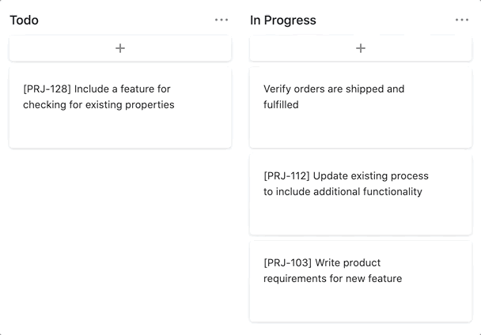

# asana-task-id

Folk from https://github.com/oppielabs/asana-task-id



e.g. `[PRJ-#] Task Name`

## Deployment

### Prerequisites

Install package dependencies

```sh
yarn
```

### Run

Rename the `.env.example` file to `.env` and update with the required values.

```
ASANA_ACCESS_TOKEN=<Asana Personal Access Token>
ASANA_PROJECT_ID=<Asana Project ID>
ASANA_PROJECT_PREFIX=<Project Task Prefix>
```

Run `yarn start`

### Register Hook

Execute the Asana webhook registration script on the deployed production URL.

```sh
yarn run register --url https://<PROJECT_URL>.now.sh/api/asana
```

### Additional Configuration

#### Environment Variables

`ASANA_WORKSPACE_ID` Enables the retrieval and deletion of existing webhooks registered with the workspace. [*Optional*]

`WATCH_CHANGES` Enables prefixes to be added to tasks that already exist when an update occurs to any field within the task. (`true`/`false`) [Default = `false`] [*Optional*]

## Development

Start the development server using the Vercel CLI.

```sh
yarn start
```

Forward the local port to the outside using `ngrok`.

```sh
ngrok http 3000
```

Register the `ngrok` tunnel with the Asana webhook functionality.

```sh
yarn run register --url https://<NGROK_URL>.ngrok.io
```

## Operations

*Note: Requires the  `ASANA_WORKSPACE_ID` environment variable.*

### Get List of Existing Webhooks

```
yarn get
```

### Delete Webhook by Id

```
yarn delete --webhookId 1178960809589035
```

## FAQ

**When registering a webhook I am receiving a `Error: Forbidden` message.**

If you have already registered the webhook once before, try deleting it and re-registering with the `yarn run register` command.
